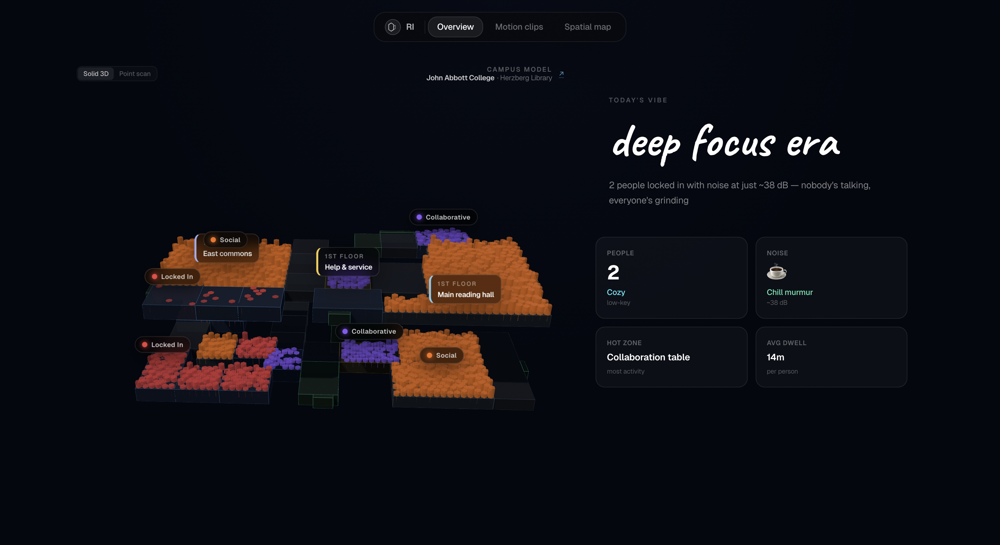

# Room Intelligence

🏛️ Real-time spatial awareness surface. See how a room is being used — live camera feeds, AI-powered occupancy analysis, and an interactive 3D model of the library.

---

<p align="center">
  
</p>

---

## Stack

Next.js 15, Three.js, Tailwind CSS, Supabase, FastAPI, Gemini, YOLO

## Run

```bash
# frontend
cd frontend && npm i && npm run dev

# backend
cd backend && pip install -r requirements.txt && python -m uvicorn app.main:app --reload --port 8000
```

## Env

`frontend/.env.local`

```
NEXT_PUBLIC_API_BASE_URL=http://localhost:8000
NEXT_PUBLIC_SUPABASE_URL=
NEXT_PUBLIC_SUPABASE_ANON_KEY=
```

`.env`

```
GEMINI_API_KEY=
CORS_ALLOW_ORIGINS=http://localhost:3000,http://127.0.0.1:3000
```

## Credits

Made by **Coco Wang** and **Faiz Mustansar**.